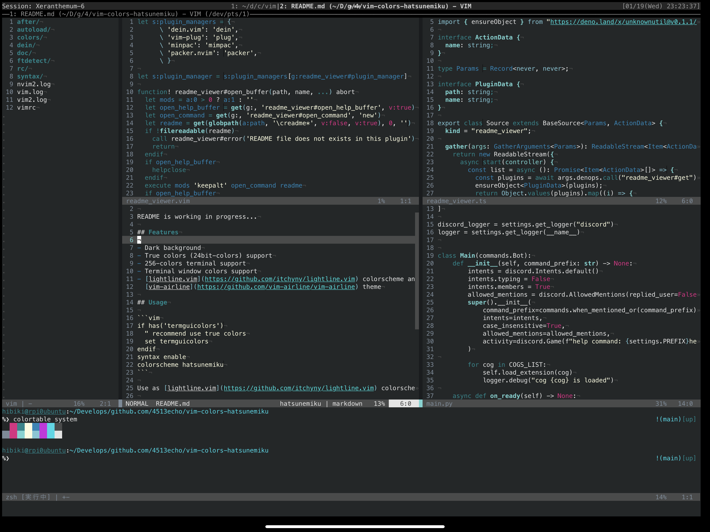

# 

## Features

- Dark background
- True colors (24bit-colors) support
- 256-colors terminal support
- Terminal window colors support
- [lightline.vim](https://github.com/itchyny/lightline.vim) colorscheme and
  [vim-airline](https://github.com/vim-airline/vim-airline) theme

## Screenshot



## Usage

```vim
if has('termguicolors')
  " recommend use true colors
  set termguicolors
endif
syntax enable
colorscheme hatsunemiku
```

Use as [lightline.vim](https://github.com/itchyny/lightline.vim) colorscheme:

```vim
let g:lightline = {
      \ 'colorscheme': 'hatsunemiku',
      \ }
```

Use as [vim-airline](https://github.com/vim-airline/vim-airline) theme:

```vim
let g:airline_theme = 'hatsunemiku'
```

## License

This work depicts the character "初音ミク" (Hatsune Miku) of Crypton Future Media,
Inc. based on [ピアプロ・キャラクター・ライセンス](http://piapro.jp/license/pcl/summary).

This plugin distributed under the MIT license.
